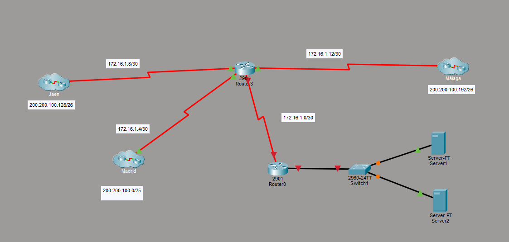
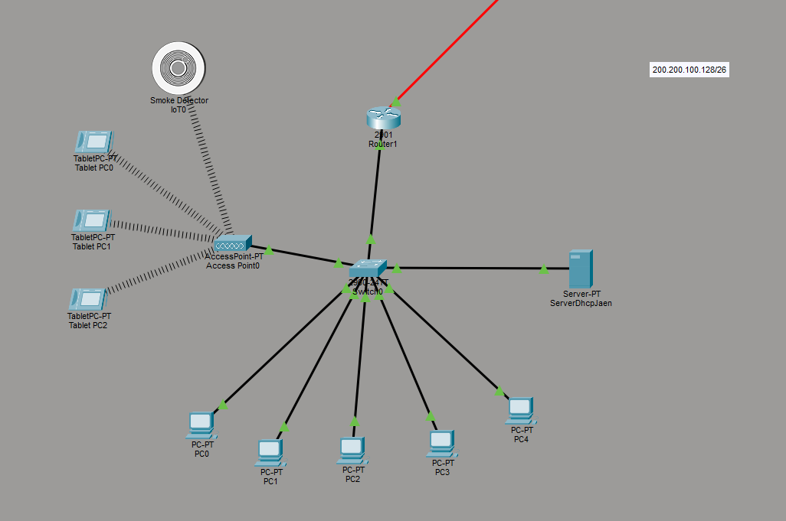
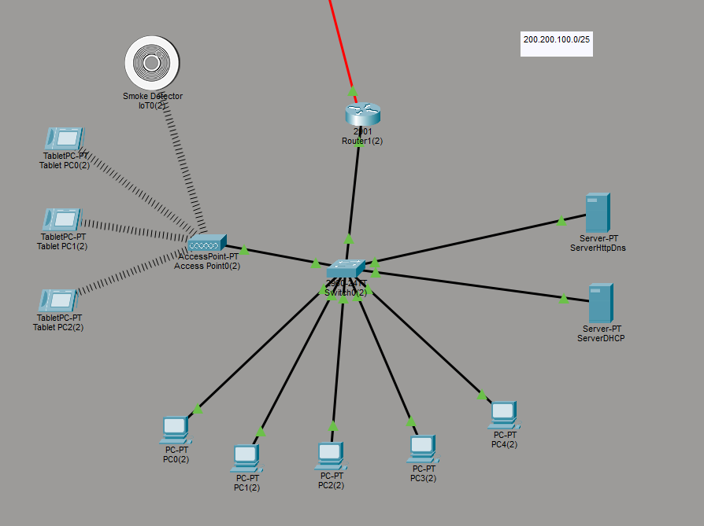
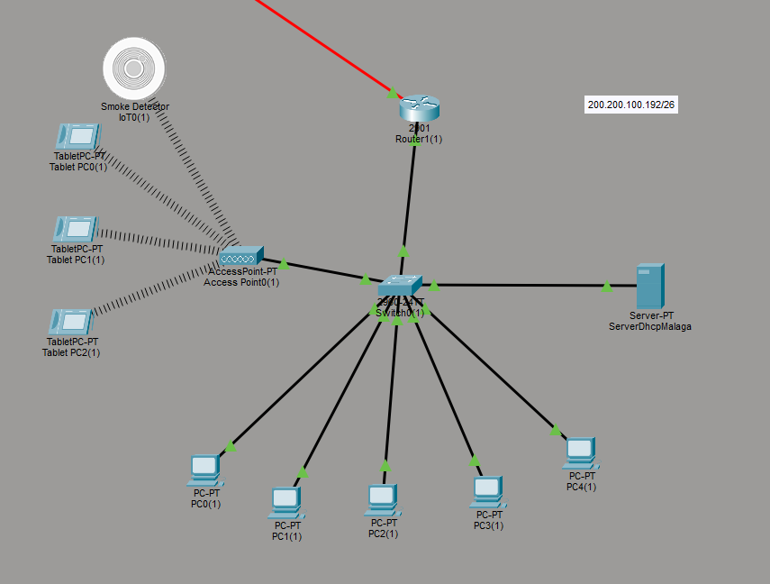

# Diseño de Red de Comunicaciones para Empresa Multisede (Packet Tracer)

Proyecto realizado como práctica de Redes de Computadores. El objetivo es diseñar e implementar la red de comunicaciones de una empresa con tres sedes distribuidas en distintas provincias de España. El trabajo incluye el diseño lógico, la planificación de subredes, la selección de dispositivos y la implementación final en Cisco Packet Tracer.

## Objetivo del proyecto
Diseñar una red corporativa que permita:
- Interconectar las tres sedes de la empresa.
- Garantizar comunicaciones internas y externas.
- Proveer acceso a Internet, videoconferencias, audioconferencias y acceso a datos.
- Gestionar direcciones IP públicas y privadas.
- Implementar DHCP, routing y conectividad completa entre sedes.

## Características de la empresa
- 3 sedes (1 central + 2 sucursales).
- Cada sede incluye:
  - 1 sala de trabajo con al menos 15 puestos.
  - 20 portátiles conectados por WiFi.
  - Despachos individuales con puestos de trabajo.
  - 3 sensores de humo (dispositivos industriales).
- La sede central contiene el cuarto de servidores.
- El ISP proporciona:
  - Rango público Clase B: 172.16.0.0
  - 64 direcciones IP públicas asignadas a la empresa.

## Trabajo realizado
### 1. Diseño lógico de la red
- Identificación de topología, dispositivos y servidores necesarios.
- Distribución de equipos en cada sede.
- Cálculo del ancho de banda necesario según:
  - Navegación web (5 Mbps/usuario)
  - Videoconferencia (10 Mbps/usuario)
  - Audioconferencia (2 Mbps/usuario)
  - Acceso a datos internos (10 Mbps/usuario)

### 2. Subnetting y direccionamiento IP
- Cálculo de subredes internas.
- Asignación de IP públicas y privadas.
- Diseño de tablas de rutas.
- Asignación de direcciones a interfaces de routers.

### 3. Implementación en Packet Tracer
- Configuración de cada sede por separado.
- Uso de servidores DHCP para asignación dinámica.
- Verificación de conectividad interna y externa.
- Agrupación de sedes como nubes de comunicación en el diseño final.

## Contenido del repositorio
- Archivo `.pkt` con la topología completa.
- Diagramas lógicos (si los añades).
- Documentación del direccionamiento IP (opcional).

## Tecnologías utilizadas
- Cisco Packet Tracer
- Protocolos de routing
- DHCP
- Redes LAN/WLAN
- Subnetting y direccionamiento IP

## Estado del proyecto
Proyecto finalizado y funcional, con conectividad completa entre sedes y acceso a Internet simulado.

## Capturas 

